# UC (Use Cases) Quizzy

## Tác nhân

| Tác nhân | Mô tả |
|---|---|
| **Học sinh** | Người dùng cuối tạo đề thi, luyện tập và học với thẻ ghi nhớ |

---

## UC-01: Tạo đề thi

**Tác nhân:** Học sinh

**Điều kiện trước:** Ứng dụng đã tải, đang ở trang Exams

**Điều kiện sau:** Đề thi mới xuất hiện trong danh sách

**Luồng chính:**
1. Học sinh bấm "Tạo đề mới"
2. Hệ thống hiện modal với ô nhập tên
3. Học sinh nhập tên và bấm "Tạo"
4. Hệ thống tạo đề thi với nội dung rỗng, thêm vào danh sách
5. Hệ thống đóng modal

**Thay thế:**
- 3a. Học sinh để trống tên, hệ thống đặt mặc định "Đề mới"

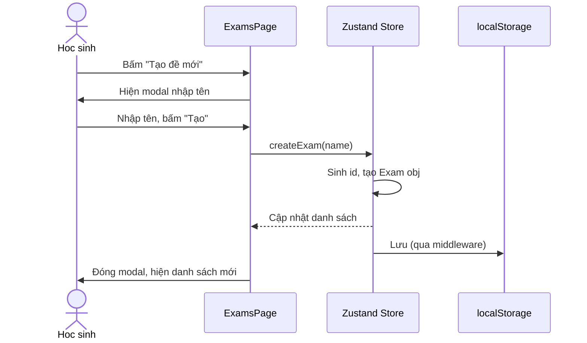

---

## UC-02: Xóa đề thi

**Tác nhân:** Học sinh

**Điều kiện trước:** Có ít nhất một đề thi

**Điều kiện sau:** Đề thi bị xóa khỏi danh sách

**Luồng chính:**
1. Học sinh bấm nút xóa trên thẻ đề thi
2. Hệ thống hiện hộp thoại xác nhận
3. Học sinh xác nhận
4. Hệ thống xóa đề thi

**Thay thế:**
- 3a. Học sinh hủy, không có gì xảy ra

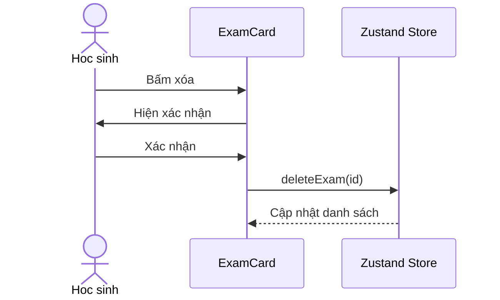

---

## UC-03: Soạn câu hỏi

**Tác nhân:** Học sinh

**Điều kiện trước:** Đã chọn một đề thi

**Điều kiện sau:** Câu hỏi được cập nhật và lưu

**Luồng chính:**
1. Học sinh đang ở tab Editor
2. Học sinh gõ vào ô soạn thảo
3. Hệ thống phân tích văn bản sau mỗi lần gõ
4. Hệ thống cập nhật bản xem trước
5. Hệ thống tự động lưu vào đề thi

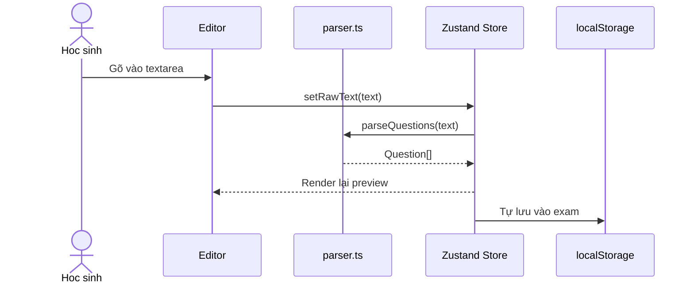

---

## UC-04: Làm bài thi

**Tác nhân:** Học sinh

**Điều kiện trước:** Đề thi có ít nhất một câu hỏi hợp lệ

**Điều kiện sau:** Kết thúc bài thi, hiển thị kết quả

**Luồng chính:**
1. Học sinh bấm tab Quiz
2. Hệ thống xáo trộn câu hỏi (nếu bật), reset đồng hồ
3. Hệ thống hiển thị câu hỏi đầu tiên với các lựa chọn
4. Học sinh chọn đáp án, hệ thống tô sáng lựa chọn
5. Học sinh bấm "Kiểm tra", hệ thống hiện phản hồi đúng/sai
6. Học sinh bấm "Tiếp", hệ thống hiện câu tiếp theo
7. Lặp lại bước 4 tới 6 cho tất cả câu hỏi
8. Ở câu cuối, học sinh bấm "Xem kết quả"
9. Hệ thống hiển thị trang kết quả với điểm, biểu đồ và các nút

**Mở rộng:**
- 5a. Nếu đúng AND bật âm thanh, phát âm thanh
- 5b. Nếu đúng AND bật hiệu ứng, bắn confetti
- 3a. Nếu bật đồng hồ, hệ thống hiện đếm ngược và tự nộp khi hết giờ

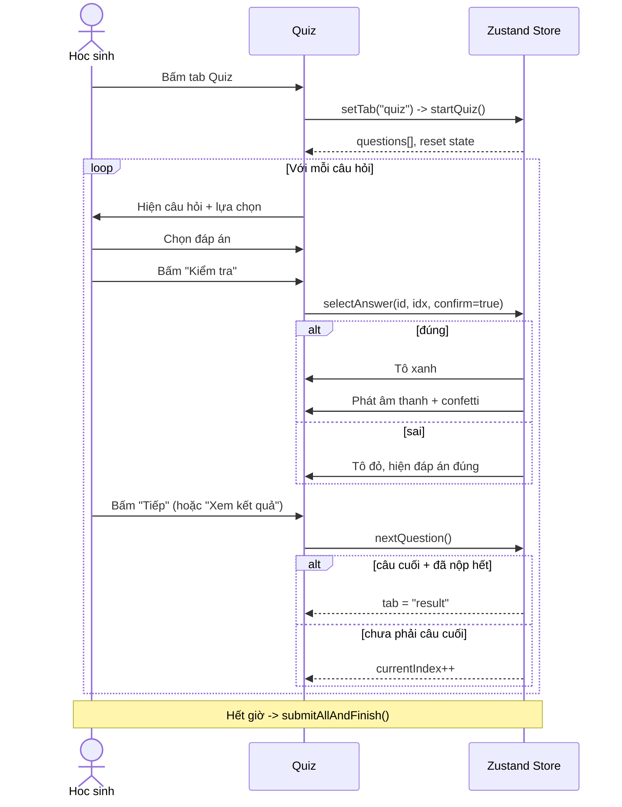

---

## UC-05: Xem lại đáp án

**Tác nhân:** Học sinh

**Điều kiện trước:** Đã hoàn thành bài thi, đang ở trang kết quả

**Điều kiện sau:** Học sinh xem lại tất cả câu hỏi với chỉ thị đúng/sai

**Luồng chính:**
1. Học sinh bấm "Xem lại" trên trang kết quả
2. Hệ thống hiển thị tất cả câu hỏi trong danh sách cuộn
3. Mỗi câu hỏi hiện: nội dung, các lựa chọn, đánh dấu đáp án đúng và đáp án đã chọn
4. Học sinh có thể tìm theo nội dung hoặc điều hướng theo số
5. Học sinh bấm "Quay lại" để trở về

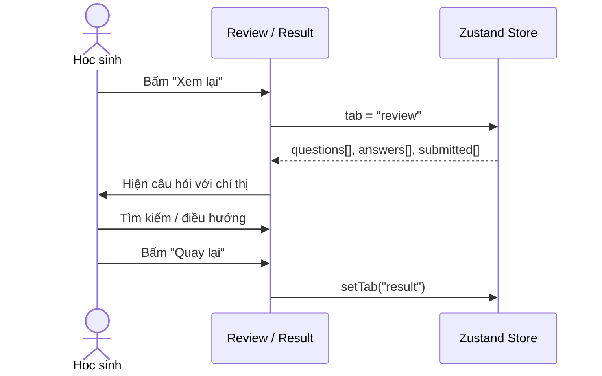

---

## UC-06: Làm lại câu sai

**Tác nhân:** Học sinh

**Điều kiện trước:** Đã hoàn thành bài thi, có ít nhất một câu sai

**Điều kiện sau:** Phiên thi nhỏ chỉ gồm các câu đã sai

**Luồng chính:**
1. Học sinh bấm "Làm lại câu sai" trên trang kết quả
2. Hệ thống lọc các câu trả lời sai
3. Hệ thống bắt đầu bài thi chỉ với các câu đó (tắt đồng hồ, xáo trộn nếu bật)
4. Học sinh trả lời và tiếp tục như UC-04
5. Khi hoàn thành, hệ thống hiển thị kết quả cho phiên làm lại

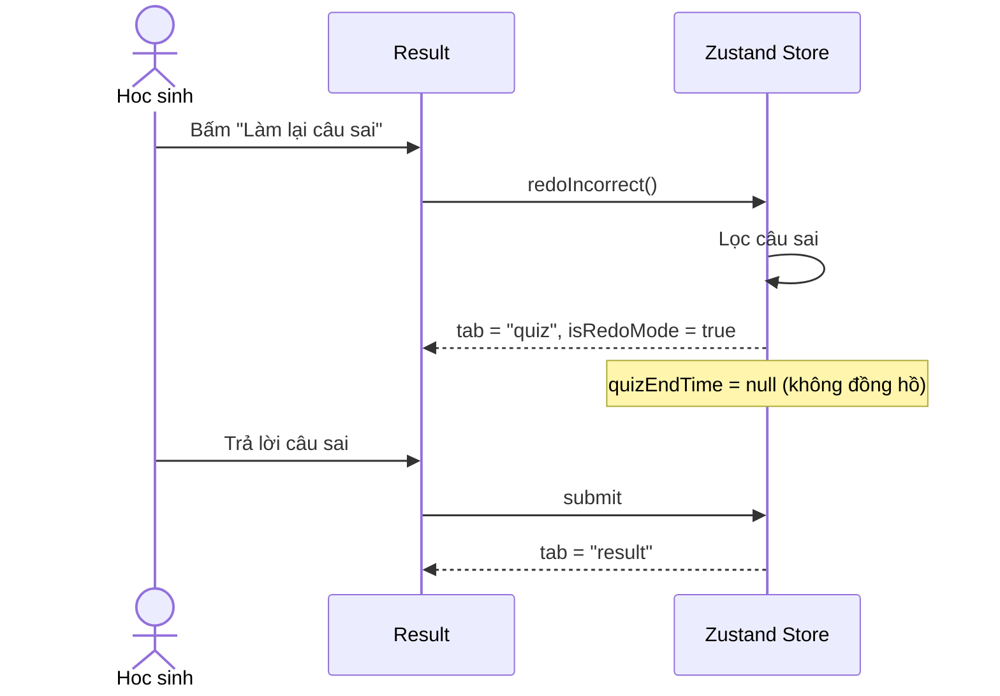

---

## UC-07: Học với thẻ ghi nhớ

**Tác nhân:** Học sinh

**Điều kiện trước:** Đề thi có ít nhất một câu hỏi hợp lệ

**Điều kiện sau:** Kết thúc phiên thẻ, hiển thị tổng kết

**Luồng chính:**
1. Học sinh bấm tab Flashcards
2. Hệ thống xáo trộn câu hỏi (nếu bật)
3. Hệ thống hiển thị câu hỏi đầu tiên dưới dạng thẻ
4. Học sinh chạm thẻ, hệ thống hiện đáp án
5. Học sinh đánh giá: "Đã thuộc" hoặc "Chưa thuộc"
6. Học sinh bấm "Tiếp", hệ thống hiện thẻ tiếp theo
7. Lặp lại bước 4 tới 6 cho tất cả thẻ
8. Ở thẻ cuối, học sinh bấm "Xem tổng kết"
9. Hệ thống hiển thị FlashcardResult với biểu đồ

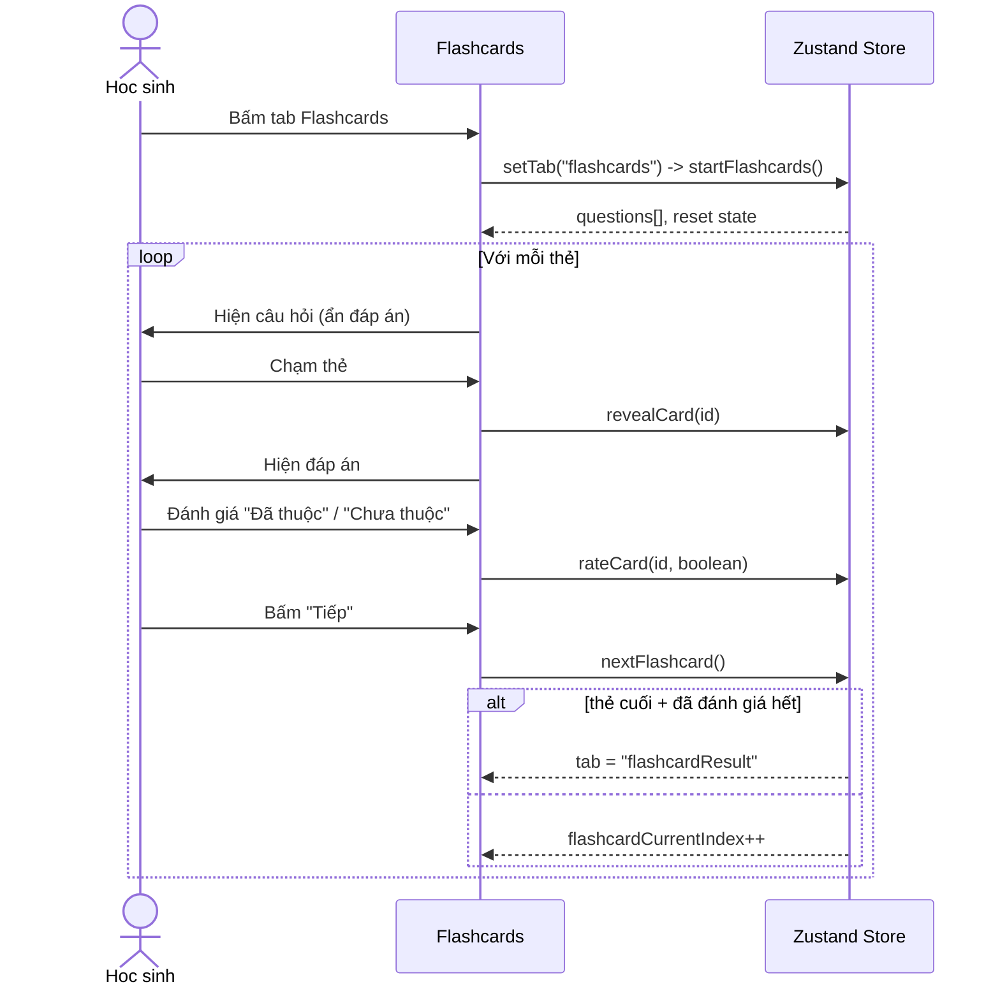

---

## UC-08: Ôn lại câu chưa thuộc

**Tác nhân:** Học sinh

**Điều kiện trước:** Đã hoàn thành phiên thẻ, có ít nhất một thẻ "Chưa thuộc"

**Điều kiện sau:** Phiên thẻ nhỏ chỉ gồm các thẻ chưa thuộc

**Luồng chính:**
1. Học sinh bấm "Ôn lại câu chưa thuộc" trên trang FlashcardResult
2. Hệ thống lọc các thẻ đánh giá "Chưa thuộc"
3. Hệ thống bắt đầu phiên thẻ chỉ với các thẻ đó
4. Học sinh học như UC-07

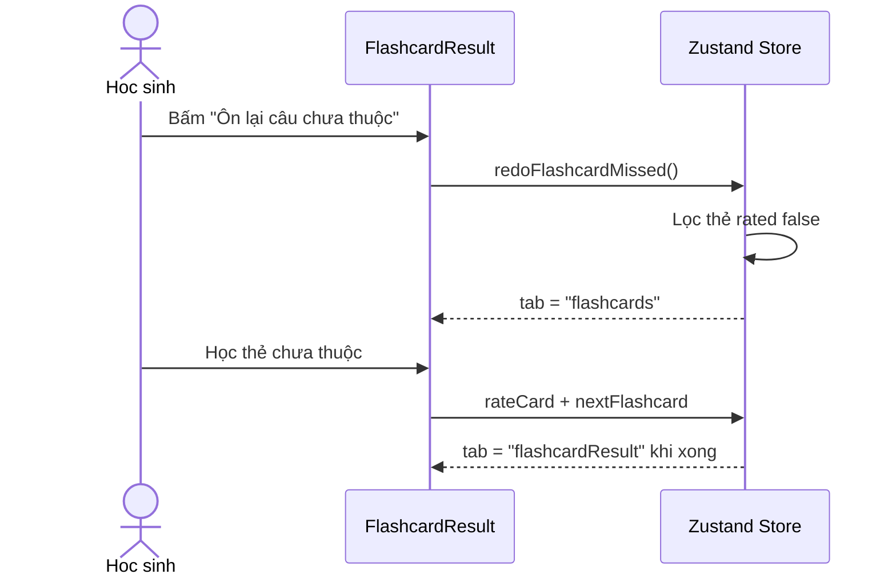

---

## UC-09: Xuất đề thi

**Tác nhân:** Học sinh

**Điều kiện trước:** Có ít nhất một đề thi

**Điều kiện sau:** File JSON được tải xuống

**Luồng chính:**
1. Học sinh bấm "Xuất" (qua Cài đặt hoặc menu)
2. Hệ thống chuyển đề thi và cài đặt thành JSON
3. Hệ thống kích hoạt tải file qua thẻ `<a>`

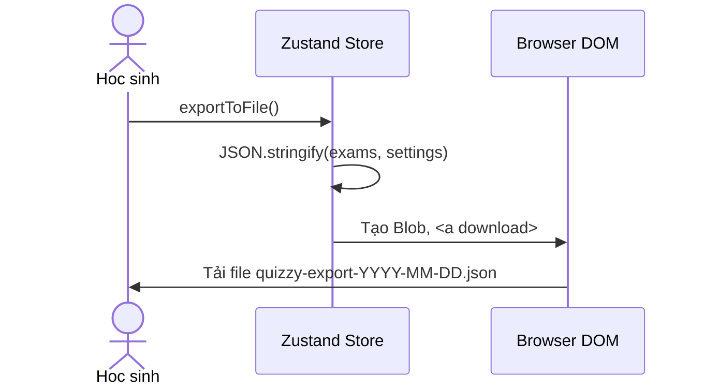

---

## UC-10: Nhập đề thi

**Tác nhân:** Học sinh

**Điều kiện trước:** Người dùng có file JSON xuất từ Quizzy

**Điều kiện sau:** Đề thi và cài đặt được tải vào ứng dụng

**Luồng chính:**
1. Học sinh bấm "Nhập"
2. Hệ thống mở hộp thoại chọn file
3. Học sinh chọn file `.json`
4. Hệ thống đọc và phân tích file
5. Hệ thống thay thế đề thi và cài đặt hiện tại bằng dữ liệu đã nhập

**Thay thế:**
- 4a. File JSON không hợp lệ, hiển thị thông báo lỗi

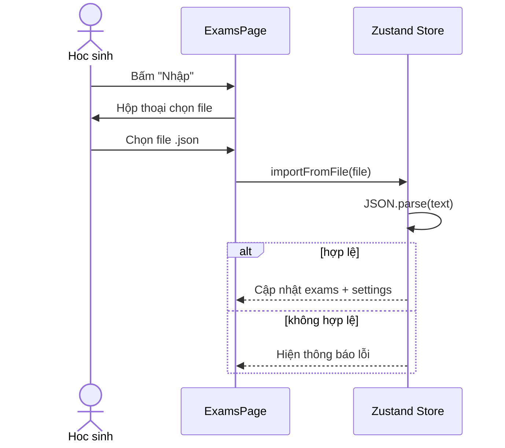

---

## UC-11: Thay đổi cài đặt

**Tác nhân:** Học sinh

**Điều kiện trước:** Ứng dụng đang mở

**Điều kiện sau:** Cài đặt được cập nhật và lưu

**Luồng chính:**
1. Học sinh bấm biểu tượng Cài đặt (hình bánh răng)
2. Hệ thống hiện modal Cài đặt
3. Học sinh bật/tắt các tùy chọn: giao diện, xáo trộn, âm thanh, hiệu ứng, đồng hồ, ngôn ngữ
4. Hệ thống cập nhật Zustand store sau mỗi thay đổi
5. Hệ thống lưu vào `localStorage`
6. Học sinh đóng modal

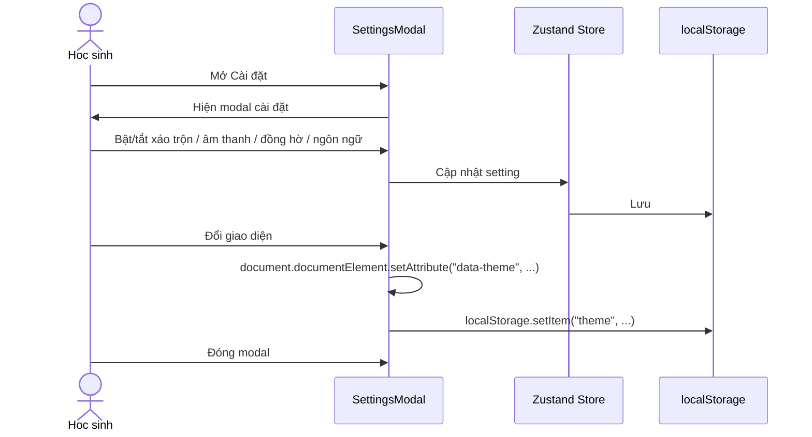

---

## Sơ đồ use case

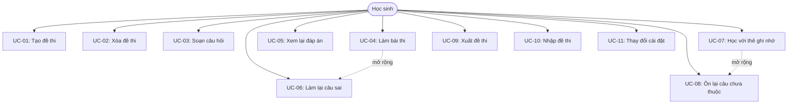
